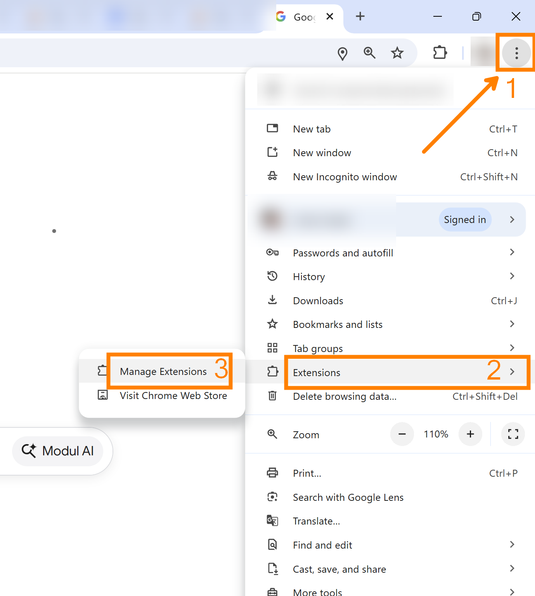
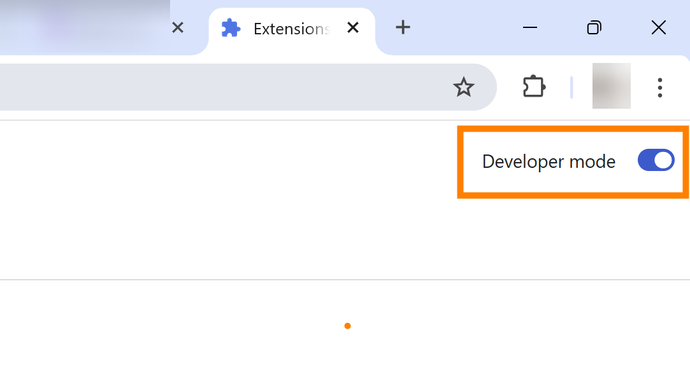
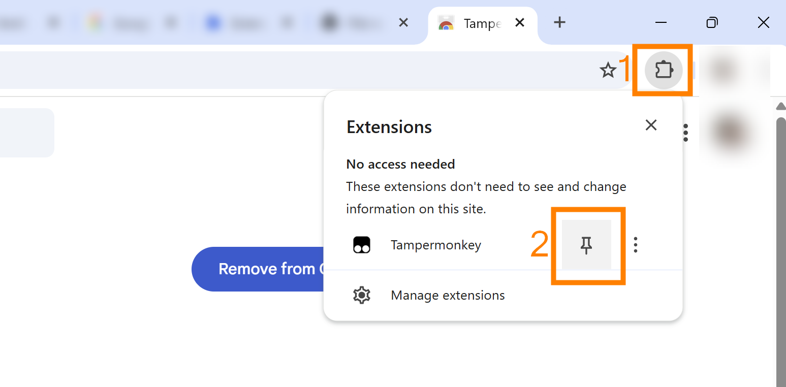
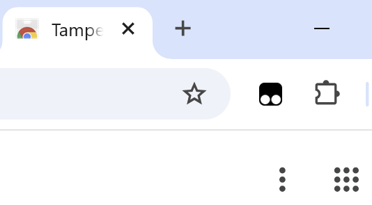

## Permite modul dezvoltator

Prima dată trebuie să permiteți modul pentru dezvoltatori (Developer mode) în Chrome Extensions:

- Click pe cele trei puncte (1) după care pe *Extensions*/*Extensii* (2) după care *Manage extensions*/*Gestionează extensiile* (3).

 

- În dreapta sus trebuie să porniți comutatorul *Developer mode*, în final să arate așa:

## Instalează Tampermonkey

- Accesați pagina extensiei in Chrome Web Store: https://chromewebstore.google.com/detail/tampermonkey/dhdgffkkebhmkfjojejmpbldmpobfkfo

- Click *Add to Chrome*

- Click încă o dată pe *Add extension*/*Adaugă extensia*

 

## Afișează extensia în bara de instrumente

- Click pe icon-ul de extensii (1) după care la icon-ul de fixare (2) lângă Tampermonkey:

După asta o să apară icon-ul în bara de instrumente:

## Pasul următor
Înapoi la pagina principală, la instalare scripturi - [click aici](../README.md#instalare-scripturi).