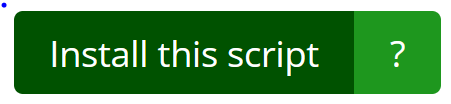
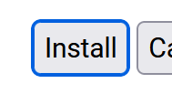
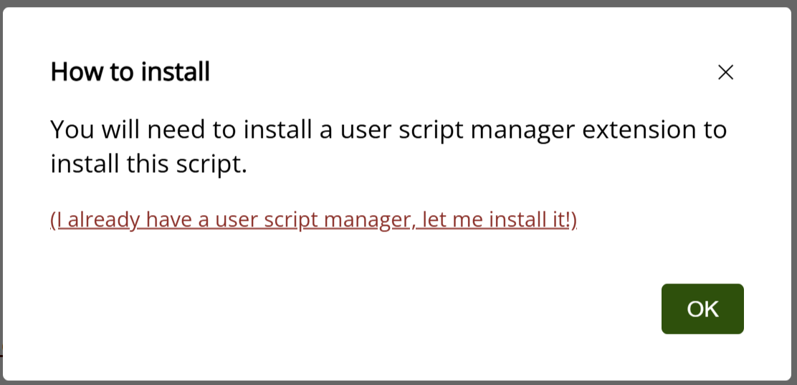
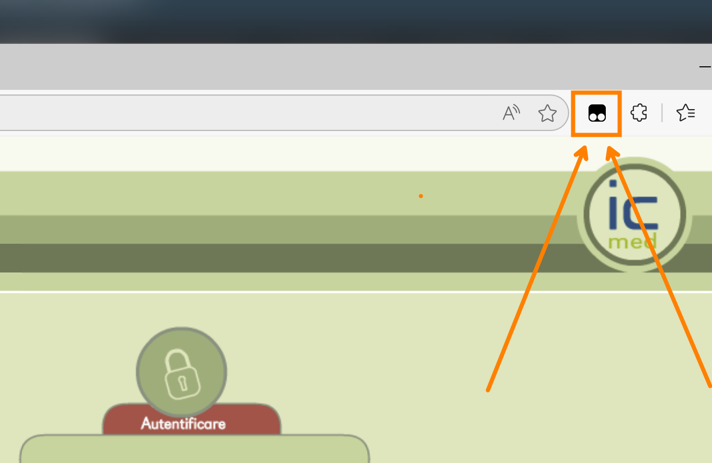
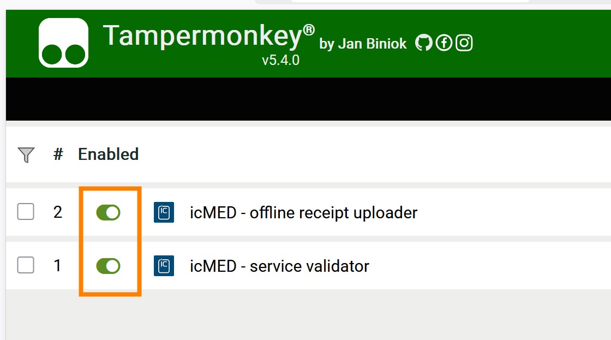

## Scriptul pt. validare servicii

- accesați pagina scriptului: https://greasyfork.org/en/scripts/526863-icmed-validare-servicii

- click pe butonul verde *Install this script*/*Instalează acest script*: 

- click pe butonul *Install*: 

> 
> ⚠️ Dacă apare o fereastră asemănătoare: 
> 
>  
> 
> înseamnă că:
>   - ori nu ați instalat Tampermonkey: urmați pașii de [Instalare Tampermonkey](../README.md#instalare-tampermonkey)
>   - ori nu sunteți în browser-ul în care ați instalat Tampermonkey: urmați pașii din acest document în **browserul respectiv**
> 

Gata!

 

## Scriptul pt. urcare rețete

- accesați pagina scriptului: https://greasyfork.org/en/scripts/526861-icmed-urcare-re%C8%9Bete-%C3%AEn-sipe

- click pe butonul verde *Install this script*/*Instalează acest script*: 

- click pe butonul *Install*: 

 

## Verificare scripturi

- în browserul în care aveți instalat Tampermonkey faceți click pe icon-ul Tampermonkey: 

> 
 

- în meniul ce apare, faceți click pe *Dashboard*

- apar cele două scripturi și ambele sunt pornite, așa cum se vede în poză:

> 
> 
> Dacă nu sunt pornite, faceți click pe acel ”comutator” să se facă verde.  
> Dacă nu apare una din cele două scripturi, urmați pașii de mai sus pt. reinstalarea script-ului respectiv.

## Pasul următor

Continuați cu [activare în icMED](../README.md#activare-clickuri-în-icmed).